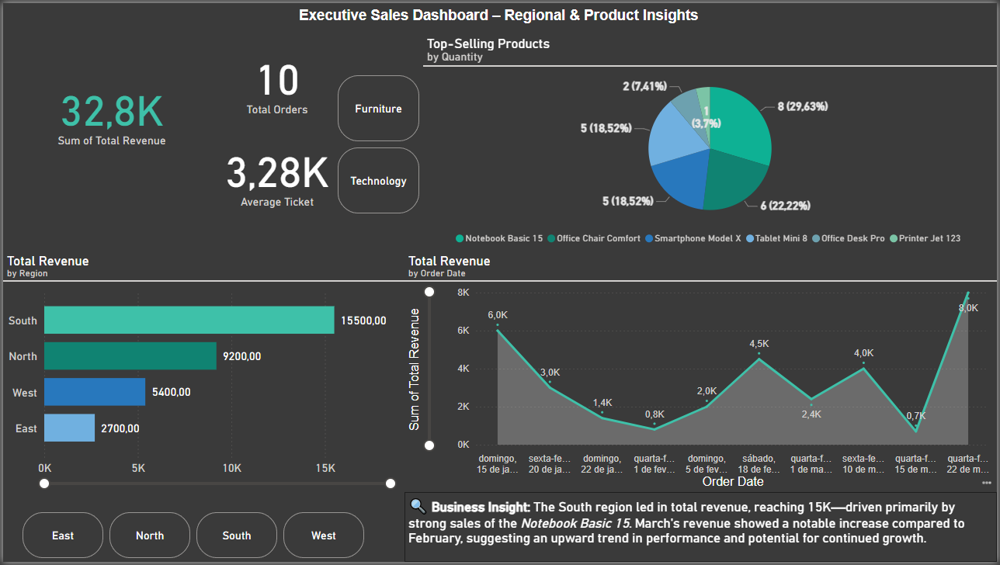

# PowerBI-SalesDashboard
Executive Sales Dashboard – Regional &amp; Product Sales Insights built with Power BI
# PowerBI-SalesDashboard
Executive Sales Dashboard – Regional &amp; Product Sales Insights built with Power BI
# 📊 Sales Dashboard – Power BI

Welcome to the **Sales Dashboard** project!  
This is a professional and interactive Power BI report created to analyze sales data across different regions, products, and categories.

 

---

## 🚀 Project Overview

This dashboard provides a quick and efficient overview of key sales metrics using simple, clean visuals. It was built as part of my journey into the **Data Analytics** field, focusing on turning raw data into actionable insights.

---

## 📈 Main Features

- **KPIs**:
  - 💰 Total Revenue  
  - 📦 Total Orders  
  - 🧾 Average Ticket

- **Visualizations**:
  - 📊 Clustered Bar Chart: Revenue by Region  
  - 📈 Line Chart: Revenue over Time  
  - 🥧 Pie Chart: Top-Selling Products by Quantity

- **Filters (Slicers)**:
  - Product Category (e.g. Technology, Furniture)  
  - Sales Region (East, North, South, West)

---

## 🔧 Tools & Tech

- **Power BI Desktop**
- Data Modeling
- DAX for basic calculations
- Data Cleaning and Transformation

---

## 📁 Data Source

Sample sales dataset used for training and portfolio purposes.  
Data includes fictitious orders with: Order ID, Date, Region, Product, Category, Quantity, Price, and Revenue.

---

## 🧠 What I Learned

- Building a professional dashboard from scratch  
- Applying design best practices to improve user experience  
- Analyzing patterns across time and regions  
- Structuring clear KPIs and storytelling with data  

---

## 🧑‍💻 Author

Caio Henrique – [GitHub](https://github.com/HenriqueData17)  
Follow my journey into Data Analytics!

---

## 📌 Next Steps

This is just the beginning. I plan to:

- Publish more dashboards (Power BI, Python, SQL)
- Create mini case studies for each project
- Apply for data analyst positions and internships

---

> ⭐ If you liked this project, consider giving it a star!  
> Let’s connect on [LinkedIn](https://www.linkedin.com/in/henrique-data) soon!
